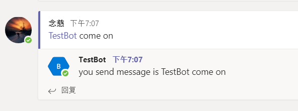

# Microsoft Teams Templates

## 先决条件

* [dotnet SDK 2.1.0](https://www.microsoft.com/net/core) 和dotnet CLI

## 使用模板

* 安装或者更新模板: `dotnet new -i MicrosoftTeams.Templates`
* 根据模板创建一个新项目: `dotnet new teamswebhook --name your-project-name`

## 开发和调试一个本地传出的web hook

* 安装ngrok，官网地址： [https://ngrok.com/](https://ngrok.com/)
* 运行 `ngrok.exe http 5000`, 因为我们本地的web api项目将会监听5000端口.
* 复制ngrok中的地址.

* 打开Microsoft Teams, 创建一个传出的webhook.  输入应用名称和应用的描述。粘贴ngrok中的url到回调Url框中。还应该加上 `api/message` 到你的回调地址中, 这个才是一个完整的终结点地址处理来自Microsoft Teams的请求。

* 点击 "创建" 按钮. 复制和保存安全令牌，留着后面备用.

* 运行命令 `dotnet new teamswebhook --name SampleApp` 来生成项目。
* 打开 `SampleApp/appsettings.json` 文件, 用刚刚复制保存的安全令牌替换这里的 `[Teams app security token]`。

* 输入命令 `dotnet run` 运行项目。
* 以上全部完成, 切换到中Microsoft Teams, @机器人应用的名称, 你的应用将会受到请求，响应信息回来.

