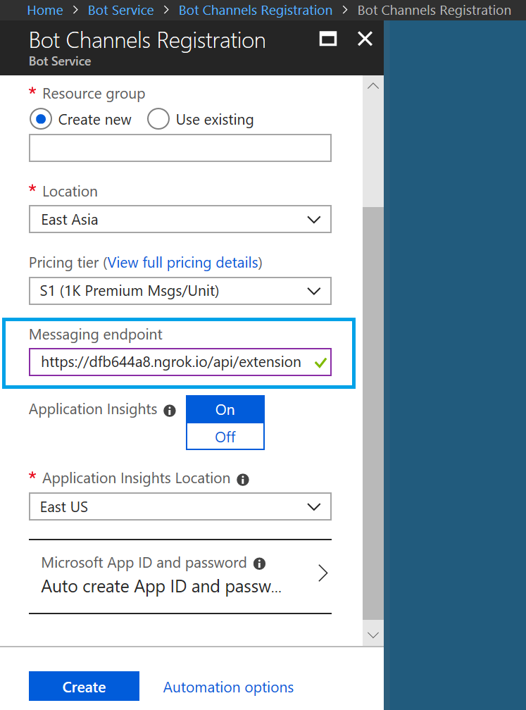
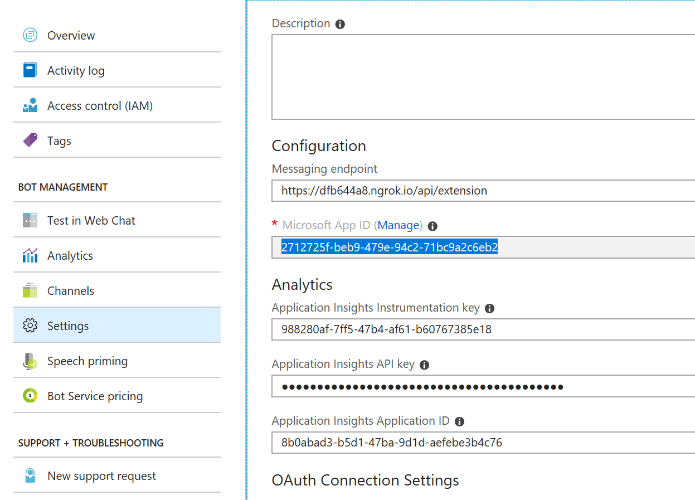
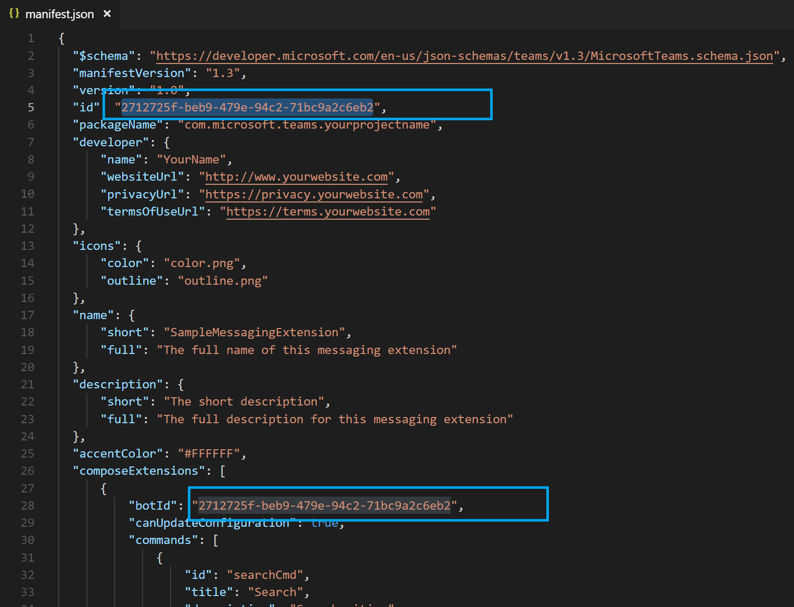
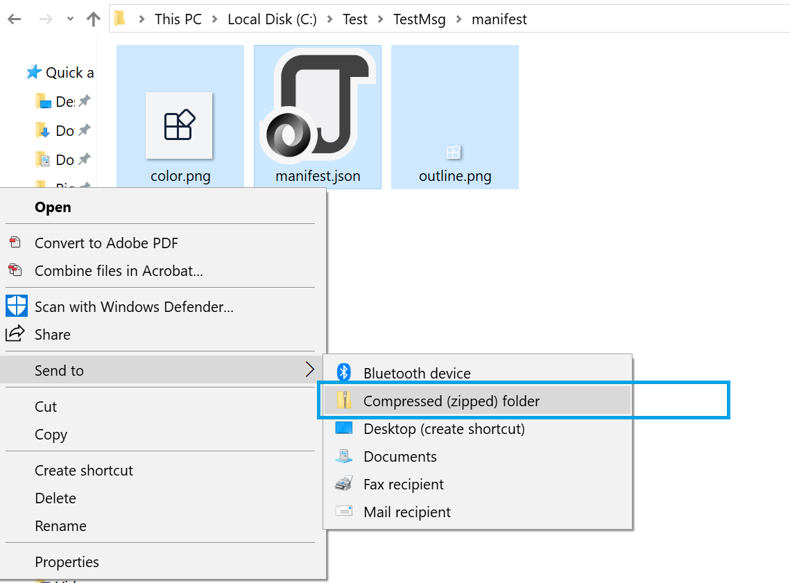
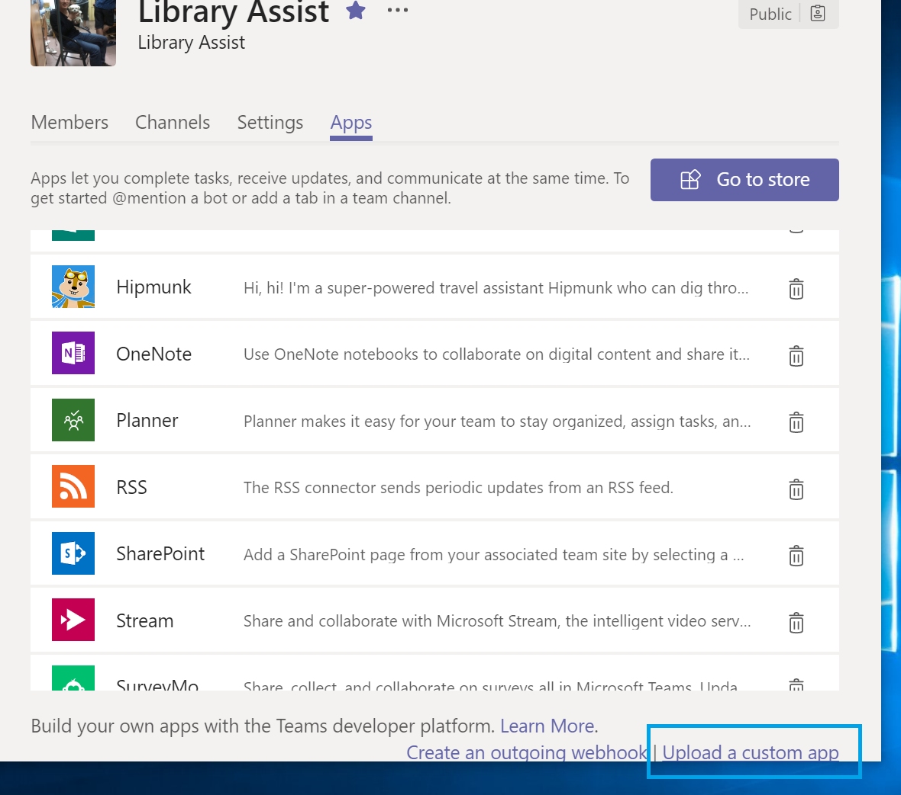
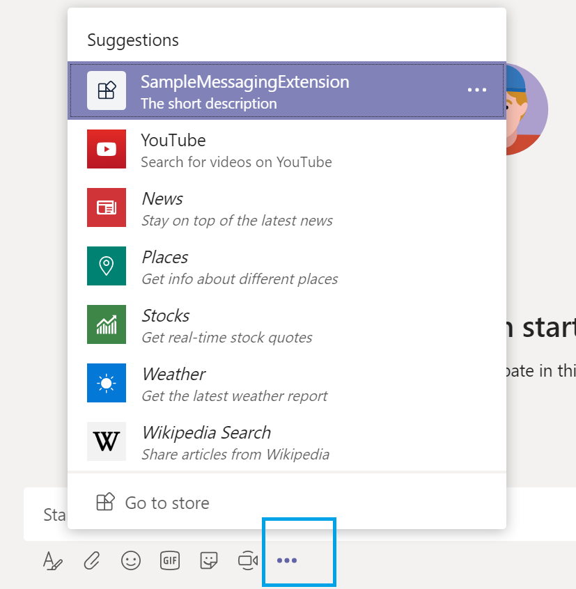
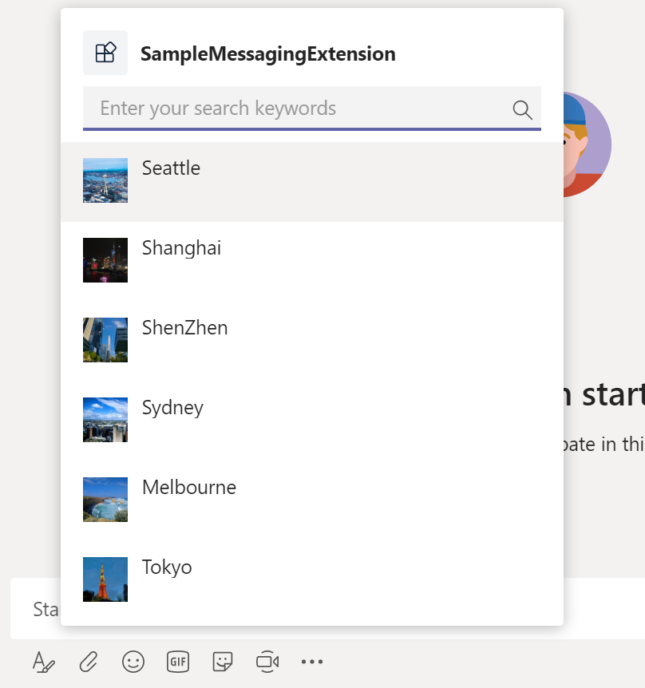
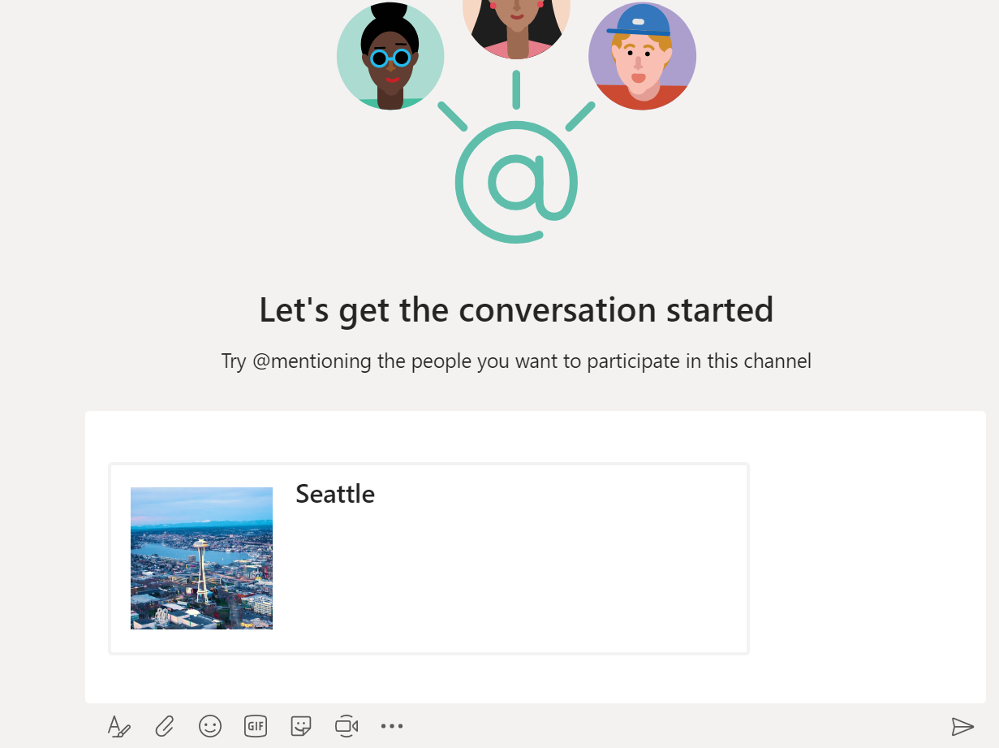

# 开发一个messaging extension

* 因为我们的web api会监听5000端口，运行ngrok，讲请求转发到此端口 `ngrok.exe http 5000`
* 拷贝ngrok生成的url.

* 使用Teams App Studio或者在Bot Framework网站上创建一个bot
 [https://dev.botframework.com/bots/new](https://dev.botframework.com/bots/new). 进一步的详细信息在 [这里](https://docs.microsoft.com/en-us/microsoftteams/platform/concepts/bots/bots-create). 对于 `Messaging endpoint`, 填入我们前一步拷贝的ngrok的url，并且在url后加上这个：`/api/extension`

* 在bot被成功创建后，记住生成的 `Microsoft App ID` ，我们在下一步会用到这个。

* 运行 `dotnet new teamsmsgext --name SampleApp` 来生成一个项目的框架.

* 用你最喜爱的编辑工具打开 `SampleApp/manifest/manifest.json` 文件, 用上一步骤获取的 `Microsoft App ID` 进行替换.

* 打包 `SampleApp/manifest` 这个目录，生成 manifest.zip 文件.

* 上传 manifest.zip 文件到你的Teams里. `Manage Team -> Apps`, 点击右下方的链接 `Upload a custom app`

* 运行你的项目，执行 `dotnet run`.

* 搞定了！你现在可以切换到 Microsoft Teams，选择刚才上传zip文件的那个团队，进入这个团队的任意一个聊天频道（channel），点击输入框下方的 `...` 按钮，你就可以看到你自己的 messaging extension了！

