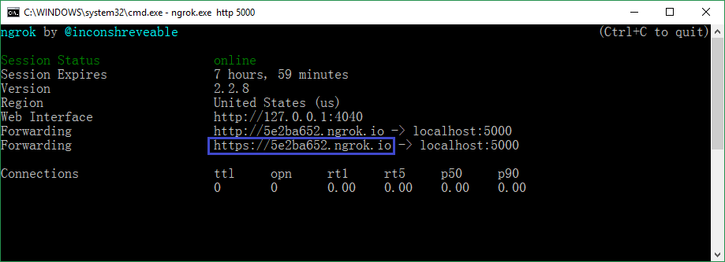
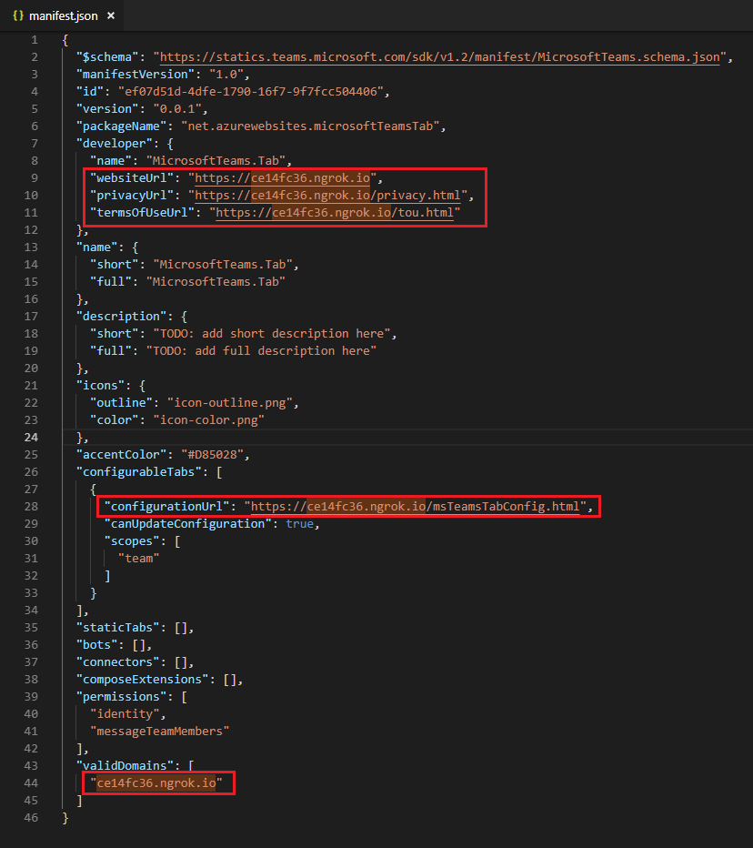
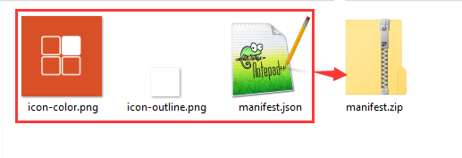
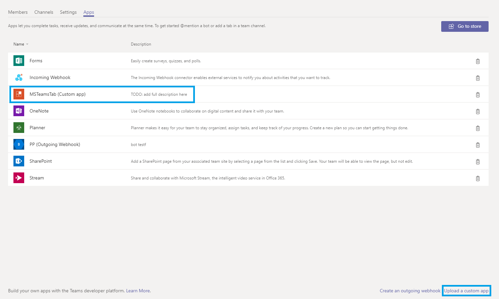
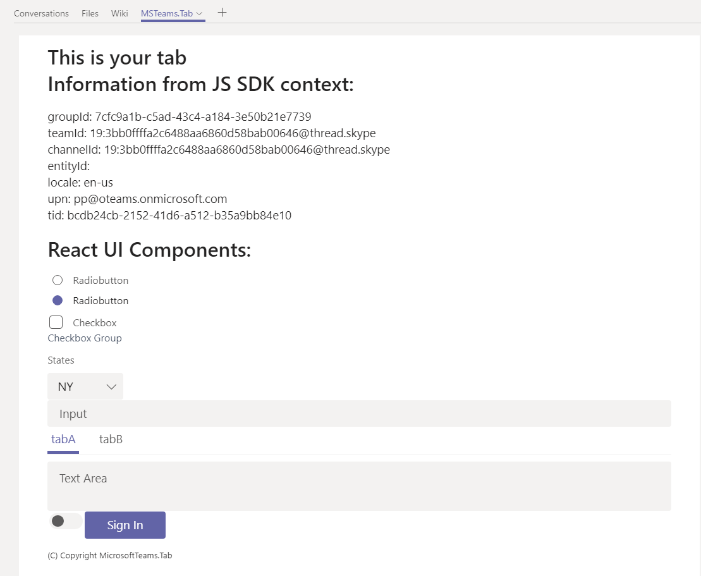

# 本地开发调试 Teams Tab 应用程序

## 准备

需提前安装：

1. [dotnet](https://dotnet.microsoft.com/download)
2. [node](https://nodejs.org/en/)
3. [npm](https://www.npmjs.com/)

## 步骤

- 下载 [ngrok](https://ngrok.com/)
- 运行`ngrok.exe http 5000`。因为我们项目启动会监听 5000 端口.
- 拷贝 ngrok 的 url (注意是：http**s**).
  

- 打开 manifest.json 文件, 将相关 url 替换为上一步拷贝的 url。
  

- 将 manifest.json、icon-outline.png 和 icon-color.png 三个文件打包为 manifest.zip. 这个 zip 包就是我们要上传到 teams 的应用包。

  

- 运行以下命令.

  1. > dotnet build
  2. > dotnet run

- 打开 Microsoft Teams, 创建一个 Tab.

  1. 找到某个 team 并进入，导航到'Apps'标签页.
  2. 点击页面右下角的'Upload a custom app'(上传自定义应用)按钮.
  3. 选择并上传刚才的压缩包 manifest.zip.
     

- 点击刚才上传的"MSTeamsTab"应用并且为需要的频道进行设置.
  

- 运行`dotnet new teamstab`命令生成项目.
