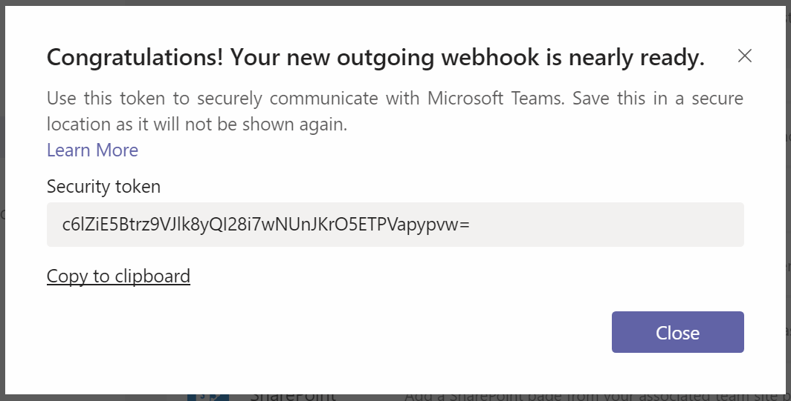
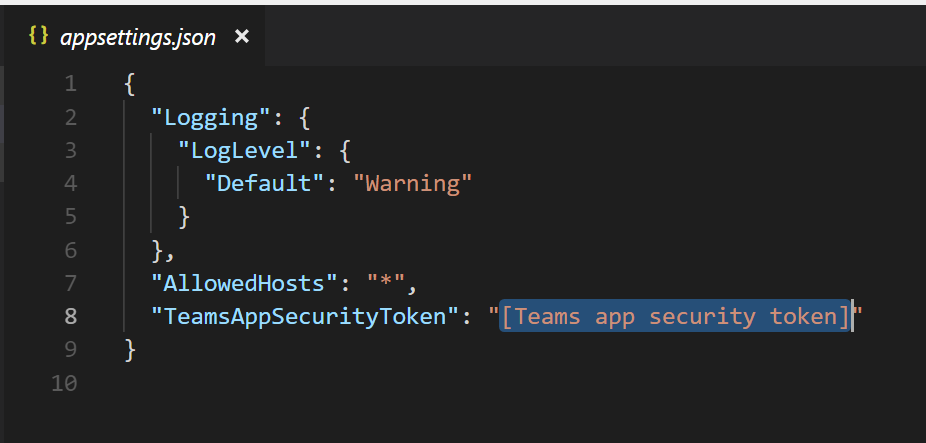

# Developing and debugging an outgoing web hook locally

* Install ngrok from [https://ngrok.com/](https://ngrok.com/)
* Run `ngrok.exe http 5000`, because our web api project will listen on port 5000.
* Copy the ngrok url.

* Open Microsoft Teams, create an Outgoing webhook. Input the app name and app description. Paste the ngrok url into "Callback URL" field. You need to append the `api/message` to your url, because this is the endpoint which handles the requests from Microsoft Teams.

* Click "Create" button. Copy and save the security token for future use.

* Run `dotnet new teamswebhook --name SampleApp` to generate the project.
* Open `SampleApp/appsettings.json` file, replace `[Teams app security token]` with the real security token you just saved.

* Start the project by running `dotnet run`.
* All done, you can switch to Microsoft Teams, @ the bot name, your sample project will send the meesage back to you.

